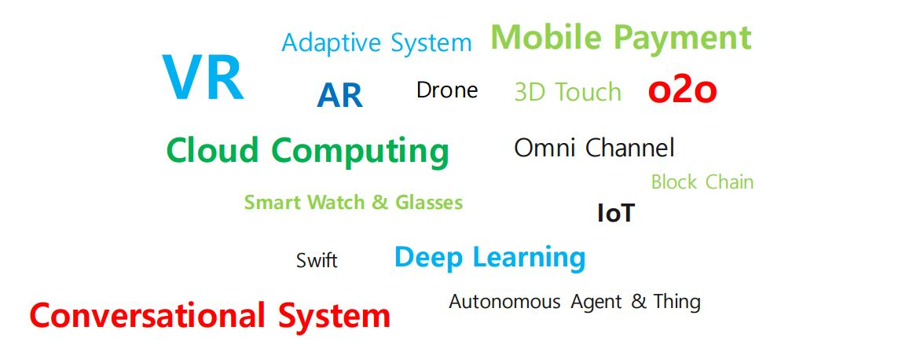
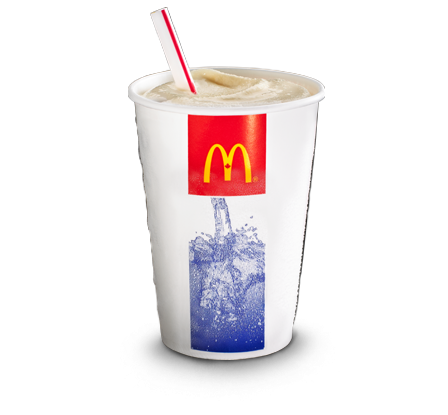

# I. 빅데이터 현황 및 트렌드

## 빅데이터의 3가지 측면
- 크고 많다.
- 변화량이 엄청나다.
- 비정형 데이터이다.

## 빅데이터의 기술
- 저장 : 추후 데이터를 사용할 목적으로 데이터가 오염되거나 사라지지 않도록 안전하고 영구적인 방법으로 **보관**하는 기술
    > - 하둡   
    > - NoSQL
- 분석 : 비정형 텍스트 빅데이터에 내개한 **가치**를 효과적으로 알아내는 방법론적 기술.  
기획단계에 포함됨. 개발단계를 이를 구현하는 단계
    > - 텍스트 마이닝
    > - 오피니언 마이닝   
    > - 소셜 네트워크 분석 (관계분석)  
	> - 군집분석 (ex.음악추천)
- 표현 : 데이터 분석을 통해 추출한 의미와 가치를 **시각적**으로 표현하는 기술
    > - R   
    > - Tableau  
    > - Gephi  
    > - Palabtier  

## 빅데이터 기술수준
1. 데이터 수집 : (아이콘 순서대로) 데이터베이스 / 외부기기 / 
		 로그데이터(사이트에 몇시에 접속했고 얼마나 머물렀는지 등) / 
		 파일 / 인터넷 / 미디어 / 모바일기기
		 (Flume, Sqoop 같은 프로그램으로 수집)
2. 데이터 Integration (HDFS + MapReduce)
3. Analytics 데이터 생성해서 
--> RDB(오라클이나 MySQL 등)에 가져옴
4. 데이터 활용

## 빅데이터 이용현황
 - 대화형 응용프로그램  
 - 실시간 스트림처리   
 - 셀프서비스 분석 (쉬운 시각화 /  스냅샷)

## 2017 기술트렌드
- VR
- AR
- o2o / Omni Channel / IoT
- Deep Learning / **Conversational System** / Autonomous Agent & Thing

# II. 빅데이터 구축목적과 목표

## **빅데이터의 구축 목적** 3가지
### 1. 더 나은 의사결정
### 2. 사용자 중심의 서비스 활동 (개인화)
### 3. 창조적인 접근

> Increase Sales Revenue  
> Reduce Cost  
> Increase Customer **Satisfaction** (만족이란, easy, pleasure, fun, joy)

# III. 빅데이터 접근방법론 및 알고리즘

## 빅데이터 수집방법 : _What_
### 교차분석
- **비즈니스거래**   
- **로그데이터**   
- **이메일**   
- 일정관리    
- **소셜 네트워크**   
- 위치정보   
- RFID   
- **센서**

## 빅데이터 수집방법 : _How_
- 데이터의 키 소스 정의 : **구분**을 잘 지어야 한다.   
	> - 업무적 or 행동적   
	> - 구조적(정형) or 비구조적(비정형)  
	> - 소셜 or 특정비즈니스  
- 데이터 접근 및 집계 (개발자적 입장)
	> - 수집하고자 하는 데이터의 장소와 방법 정의  
	> - 데이터개별 저장소나 중앙DB 저장소 생성  
- 신규 고객 생성과 키 데이터를 이용한 프로필 예측  
	> - 누가 언제 활동을 했는지
	> -	어떤 **유입경로**를 통해 이용했는지 (Apache 등으로 알 수 있음)
- 사업규칙과 데이터마츠 자동결합 시스템 구축  
	> - 가장 잘 드러난 DB요소 추가  
	> -	변화와 트렌드 **모니터링** (시각화 툴을 이용해)
- 올바른 마케팅메세지로 프로파일 조정  
	> - **판매 타이밍**, 채널, 메세지, 주문을 개인별로 타깃화  
	> - 연관성이 높은 **커넥션** 생성

### 여담
   
나이키 경쟁상대 --> 닌텐도   
(나이키 판매실적 하락 당시 10-20대에서 닌텐도 판매량 증가)  
   
맥도날드 밀크쉐이크 경쟁상대: 바나나  
(아침 시간대 대중교통에서 식사대용으로 밀크쉐이크를 먹다가 자주 흘려서 이를 극복하기 위해 걸죽하게 만듬) 

## 빅데이터를 이용한 알고리즘
DB --> connection
Web --> crawling
SNS --> API(twitter, facebook)
media
file --> csv, txt.
모두 다른 형태 이를 묶어주는 것이 Big Data(Hadoop 등)
-->요소와 규칙(알고리즘)을 가지고 위를 활용--> 서비스(추천, 개인화)

### 알고리즘 : 어떠한 문제를 해결하기 위한 여러 동작들의 유한한 모임
	     명확하게 규정된 법칙을 이용해 실행 가능하게 만드는 것
	     개발자들이 하는 업무아니고 기획단계임 이를 구현하는 것이 개발
> - 연합  
> - 연속  
> - **분류**  
> - **집단화**  
> - 예측(**패턴**을 통해 미래예측)  
>			- 자주발생하는 패턴  
>			- 연역적 알고리즘(Apriori) 연관성 유추  

- Apriori : 데이터들에 대한 발생빈도를 기반으로 각 데이터간의 
	    연간관계를 밝히기 위한 수학적 접근

### 빅데이터 알고리즘의 일반적 사용처  
- **추천엔진** (자동화)  
- 네트워크 모니터링
- **감성분석** (평판분석)  
- 사기행위 탐지
- 리스크 모델링 (가설) 
- **고객 경험분석**  
- **마케팅 캠페인 분석**
- 고객 이탈분석  
- R&D
- **소셜그래프** 분석 (관계에 대한 분석)

