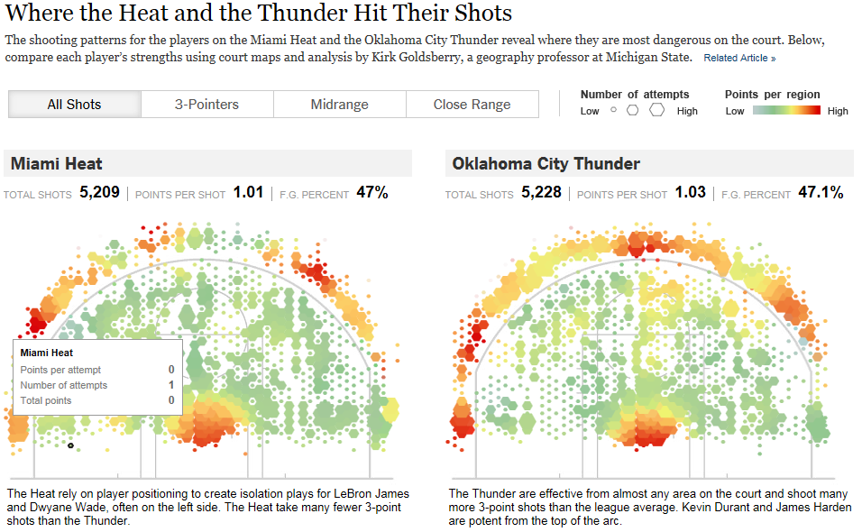
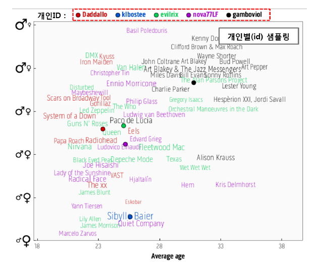
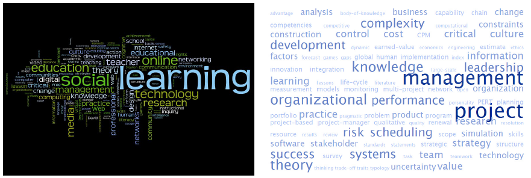

# IV. 빅데이터 분석 및 활용을 위한 시각화

## 빅데이터 시각화의 필요성
- 방대하고 변화가 빠른 스트리밍형 비정형 데이터인 빅데이터의 **인사이트**(내면을 보는것)를 도출하고 서비스를 구현하기 위해

## 빅데이터 시각화의 종류
> 시간  
> 공간  
> 분포  
> 관계  
> 비교

## 빅데이터 시각화에 많이 사용되는 기법
- **소셜그래프**
- **Heat Map**
- **Bubble Chart** / 점분포
- Matrix (분포/관계/비교가 아주 잘 표현됨)

### 1. 시간
- **Timeline**(+motion)  
  - [simile-widgets.org](http://www.simile-widgets.org/timeline/)  
(ex. 뉴욕타임즈의 박스오피스그래프 / 쏘메에서 본 그래프)  
x축 시간 / y축 데이터양

### 2. 분포
- **Bubble Chart** / 점분포  
  - [visualizefree.com](https://www.visualizefree.com/)

### 3. 관계
- **소셜그래프**  
  - [mentionmapp.com](http://mentionmapp.com/modules/free/)

### 4. 비교
- Treemapping
- Matrix    
  - [visualizefree.com](https://www.visualizefree.com/)

### 5. 공간
- Bubble Chart
- Heat Map

### 기타 시각화 툴
| 구분 | 이름 | 설명 | 비고 |
|---|---|---|---|
| Web App | [infogram](https://infogram.com) | 인포그래픽, 시각화 저작툴 |   |
|   | [visualizefree](https://www.visualizefree.com/) | 정보 시각화 |   |
|   | [mentionmapp](http://mentionmapp.com/) | 소셜 그래프 시각화 |   |
|   | [wolframalpha](http://www.wolframalpha.com/) | 검색기반 시각화 |   |
|   | [outworldindata](https://ourworldindata.org) | 정보 시각화 |   |
| Open Source | [leafletjs](http://leafletjs.com/) | 오픈소스기반 Map시각화 저작툴 |   |
|   | [d3js](https://d3js.org/) | 오픈소스기반 시각화저작툴 | [languagenetwork.cotrino.com](http://languagenetwork.cotrino.com/) 참고 |
| PC Software | [tableau](https://www.tableau.com) | PC,모바일에서 드래그방식으로 사용가능한 범용 시각화 저작/분석 툴 |  |
|   | [gephi](https://gephi.org/) | 무료사용가능한 관계도 시각화 툴 |  |

# V. 빅데이터 기획을 위한 UI디자인

## 정보시각화 디자인
- 정보의 문맥과 프로세스를 보다 구체적이고 명료하게 사용자에게 전달하는 역할
- 폰트
  - 운영체제가 제공하는 폰트를 선택하는 것이 가독성 측면에서 좋다.
  - 한 서비스 화면에서는 하나의 폰트만을 사용한다.
- 텍스트
  - 테이블에서 사용 시 색과 굵기로 변화를 준다.
  - 정보를 구분하거나 강조할 시에만 다른 색으로 구성하여 시각적 효과를 높인다.
  - 데이터의 이름이나 크기를 나타내는 텍스트는 데이터 포인트 바로 옆에 사용한다.
- 문맥
  - 폰트나 텍스트같은 타이포그래피보다 더 중요한 디자인적 요소
  - 뛰어난 감각과 깊이 있는 문장을 만들어 사용자와의 의사소통을 향상시킨다.
  ----------
- 색상
  - **잘 구분**되고 쉽게 외워지는 색상
  - 디테일한 정보를 표현할 때는 명도 대비와 색상 대비
  - 색상코딩 시 red/green/yellow/blue/pink/brown/orange/gray/purple 순서로 사용해본다.
  - red/green 사용 시 적록색맹을 고려해 부가적인 시각적 특징을 섞어 쓰는 것이 좋다.
  - 좁은 영역을 상대적으로 채도가 높게, 넓은 영역은 낮게 하는 것이 좋다.
  - 강조 시 배경색과 대비가 커지는 방향으로 색상을 부여한다.
  - 지도에서 지형의 높낮이나 fMRI에서 활성 정도 등을 표현할 시 색상뿐만 아니라 반드시 **명도**차도 활용해야 한다.
  > 색상팔레트 참고 사이트 : [Dribbble](https://dribbble.com/)  

### 예시
   

출처 : [nytimes.com](http://www.nytimes.com/interactive/2012/06/11/sports/basketball/nba-shot-analysis.html)  

    

출처 : Last.fm Playground의 Gender Plot   

     

Tag Cloud 방식 

## 시각화 UI Design

- Data Trackingn 시각화  
  > = Dashboard  +  위치정보  +  시간정보(Time Line)  +  변화과정

### 실습 
- 1억 명의 전화번호부 디자인
  - 최근 통화한 사람
  - 가장 많이 통화한 사람 (top 10 기법)
- 사당동 주변 맛집 시각화 그래프
  - Timeline 기법 추가해서 개선 가능
  - LBSNS (위치기반 서비스)
  - 아직까지 우리나라 대표 성공사례 없는 듯
- 내 이상형 시각화
  - 트위터와 페이스북 이용자를 대상
  - 관계형 시각화 (소셜 그래프로 표현)

# V. 빅데이터 사업기획 방법 및 활용사례

## 회사 업무적 활용사례

-  [넷플릭스](https://www.netflix.com/) 사례  
    - Item-Item Algorithm  
    - User-User Algorithm  
- 국방 해양탐사 활용사례
- [서울시 심야버스 운영](https://zeronova.kr/2013/08/07/seoul-bus-route-optimization/) 사례
- 추천과 연관성을 기반으로 한 이미지 검색 UI
